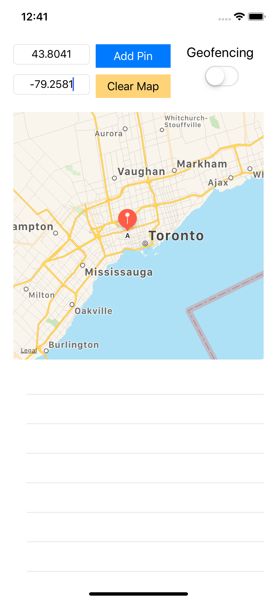
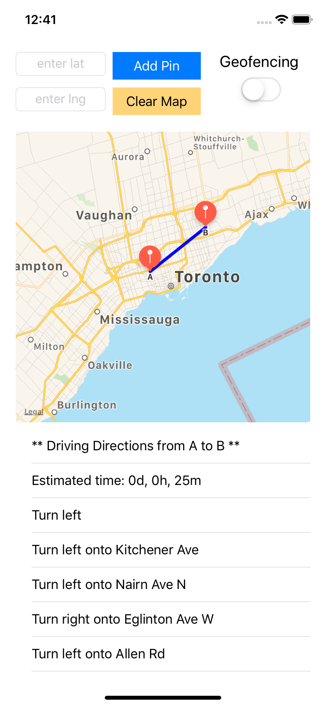
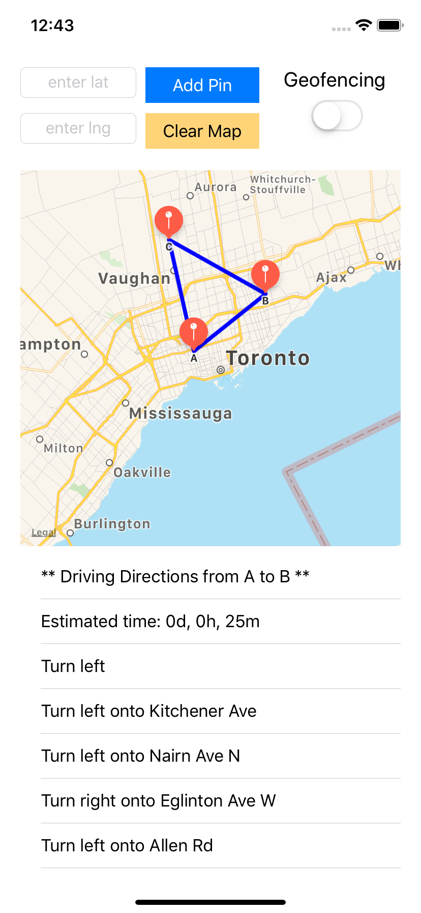
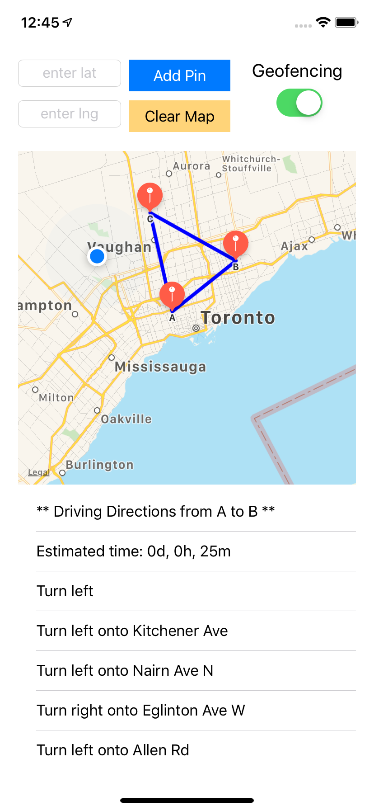
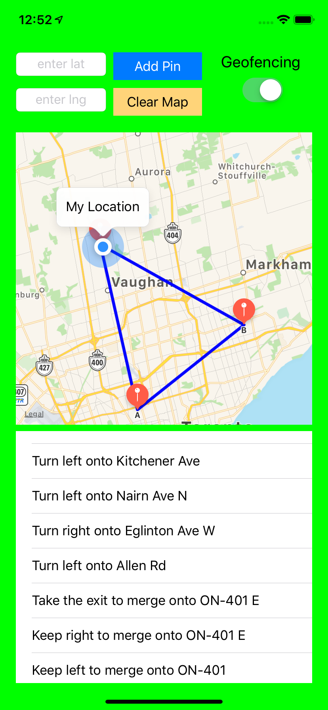
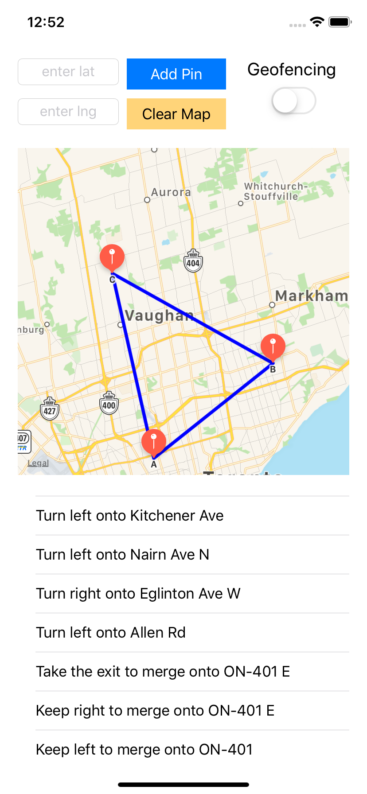

# Directions and Geofencing

#### App that demonstrates the MapKit and Core Location features of an iOS device.

#### Technology/Concepts Used
* UIKit, MapKit, CoreLocation

* Map display, polylines, zoom and markers

* Current location and distance calculation

* Geofencing

#### Screenshots  

                         

#### Features
* Marker setting of up to 5 markers by specifying longitude and latitude

* Text direction is displayed if 2 or more markers are added. Direction is specified from Marker A to B, Marker B to C and so on. The last marker will then be connected back to the first marker (Marker A) with the text direction also specified. 

* Drawing of polylines between 2 markers added in sequence with the last marker connecting to the first marker.

* Toggling of geofencing function. If geofencing is ON, background color changes to green if current locations falls with 1000m of any of the markers.

#### Link to specification: <a href="./docs/App Specs.txt" target="_blank">[App Specification]</a>

